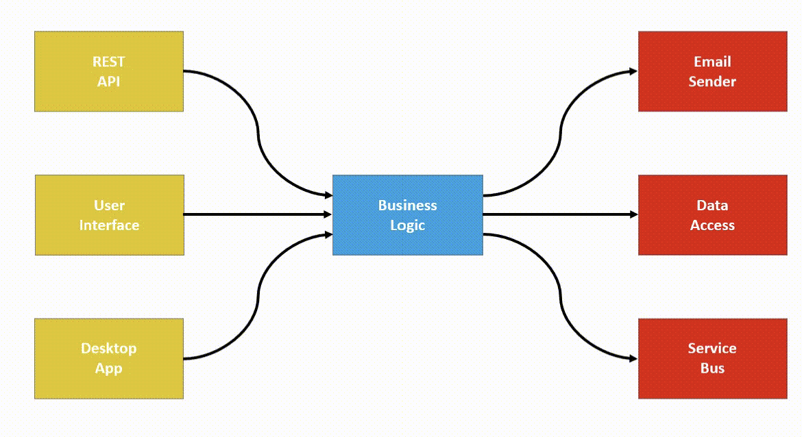

## О проекте
CalculatorApp

## Задание
Необходимо реализовать консольный калькулятор (или веб-интерфейс), который принимает входную строку, содержащую математическое выражение (целые и десятично-дробные числа, знаки +, - *, / и скобки) и выводит в консоль результат вычисления. 

#### Технические требования

1. Задание предполагает самостоятельную реализацию парсинга и расчета математического выражения.

2. Использование при разработке TDD и принципов SOLID. Архитектура должна обеспечивать расширение списка поддерживаемых операций при минимальном и безболезненном для существующей функциональности внесения изменения в исходный код. Код должен быть легко читаем и отформатирован в едином стиле, содержать минимальное число поясняющих комментариев.

## Реализация

Проект построен на n-слойной архитектуре. Проект не предполагает Infrastructure модуля для работы, например, с БД или внешними API.



Благодаря использованию данной архитектуры переход на другие внешние компоненты становится легкоосуществимым, поскольку бизнес-логика не зависит от логики работы других слоев — инверсия зависимостей. По этим же причинам переход, например, на сторонний API,  который бы нам подсчитывал более сложные выражения или добавление бэкенд проекта в решение не потребует больших усилий.

Также есть проблемы анемичной модели предметной области. Но специфика проекта на данном этапе не предполагает богатой модели предметной области.

Реализовал и консольный вариант и веб-интерфейс. Веб-интерфейс находится в папке frontend. BFF к нему написан на ASP.NET Core.

### Соблюдение TDD и SOLID

При разработке использовал практику TDD.

Сначала создавая интерфейсы в приложении (принцип разделения интерфейсов). 

Потом внедрял эти интерфейсы в другие слои (принцип инверсии зависимости). 

Потом писал тесты для методов в этих интерфейсах (Unit-ы).

Потом реализовывал конкретный интерфейс и внедрял в DI-контейнер (принцип подстановки Барбары Лисков).

## Проекты для запуска
#### Byndyusoft.CalculatorApp
Запустит консольное приложение

#### Byndyusoft.Web
Запустит бэкенд. 

## Структура проекта
```
├─── src
│   ├─── Byndyusoft.Core
|   |    |─── Models <- модели бизнес слоя
|   |    |─── Services <- сервисы
│   └─── Byndyusoft.Presentation
|       |─── Contracts <- контракты presentation слоя
|       |─── Mappings <- маппинги контрактов presentation слоя в модели слоя бизнес логики
|       |─── Program.cs <- точка входа в приложение
|   └─── Byndyusoft.Web <- web, тоже presentation слой
|       |─── Contracts <- контракты presentation слоя
|       |─── Mappings <- маппинги контрактов presentation слоя в модели слоя бизнес логики
|       |─── Program.cs <- точка входа в приложение
└─── tests <- тесты
```

## Добавить от себя

Решил не тянуть дольше полутора дней с тестовым заданием, поэтому скидываю вариант без добавления контейнеризации. Если бы добавлял контейнеризацию, то использовал бы docker-compose для связки контейнеров backend и frontend. Также необходимо было бы вынести в переменные окружения url фронтенда на бэкенде для добавления политики Cors, и url бэкенда на фронтенде.